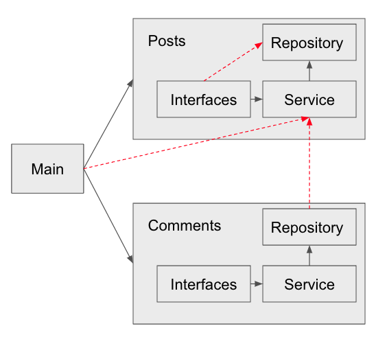

# Architecture governance

[](https://github.com/mfloriach/linters_test/actions/workflows/development.yml)

Example of how to control mesure and prevent a code base degradation by using:
- metrics
- compliance
- custom linters

**Note:** this repository is for test purposes therefore is not ready for production.

## Architecture definition

- Divided by domain (modules)
- Facade Pattern
- Multiple interfaces (grpc, restful Api)
- Repository pattern (multiple database, testing)
- No connections between modules

## Reports
[📈 metrics analysis of the module.](https://mfloriach.github.io/linters_test/output.html) 

[📋 architecture compliance report.](https://mfloriach.github.io/linters_test/output.html) 

## Installation
Unfortunality some libraries are mandatory to be compile in the local machine. To avoid that step all command will run in docker container. Start by creating the image.

```
make install
```

### Architecture compliance
It generate a report of how close your source code is to the architecture compliance defined on `arch-go.html`

```
make arch
```

After running the code on `.arch-go/report.html` you can check the results.

**Nota:** for a more finest configuration (CD/CI) refer to this package [link](https://github.com/fdaines/arch-go)

### Architecture metrics
Generates a report of the abstraction, inestability and distance of all packages in your source code.

```
make metrics
```

After on the `spm-go/output.html` you can check the results.

**Nota:** for a more finest configuration (CD/CI) refer to this package [link](https://github.com/fdaines/spm-go)

### Architecture graphic explorer
Generate and interactive graph with the relationship between modules, classes,  function ...

```
make graph
```

Once is ready it, the server will be available via [http://localhost:7878](http://localhost:7878)

**Nota:** this library consume a lot of memory it is problematic to run it inside a container so make sure you docker engine/colima/rancher has a least 2GB of memory and even thoug it will take some time to be ready.