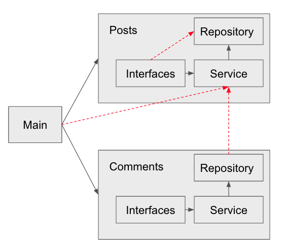

# Architecture

Contents:

* [Explanation](#Explanation)
* [Examples](#examples)
* [Notes](#notes)

## Explanation
The code structure must follow the rules of the grpah below:

## Notes
- repository pattern
- modules follows facade pattern
- no connections ara allowed between modules
- multiple interfaces (restfull api, graphQl, GRPC)